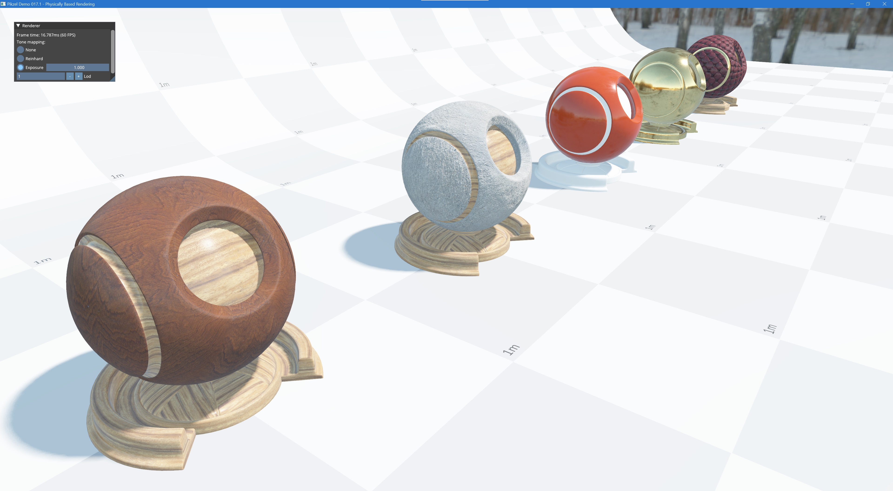

# Pikzel

A simple rendering engine for OpenGL and Vulkan.  This is not (yet) a "game engine".  So far it does only graphics.  There is no audio, no physics, no AI, no networking, etc. Scene "editor" is in development.

This project is mainly a learning exercise for me, and I hope that the code is clear and simple enough to be accessible to other developers out there that are just starting on a graphics programing journey.

## Goals
- Provide a simple abstraction layer over different rendering APIs (such as OpenGL, Vulkan, etc.)
- Application developer is free to interact with the engine at a low level (e.g. write your own shaders, issue your own draw calls), or can use higher level "renderers" provided by the engine.  These will render a scene for you.
- Be accessible to beginners. To this end, a series of demo applications are included that pretty much follow along the [learnopengl.com](https://learnopengl.com) tutorials.

## Features
- [ ] Supported platforms
  - [x] Windows 10
  - [x] Linux
  - [ ] Mac
  - [ ] Mobile

- [ ] Rendering APIs
  - [x] OpenGL
  - [x] Vulkan
  - [ ] DirectX
  - [ ] Metal

- [ ] Application Framework
  - [x] Entry point
  - [x] Logging
  - [x] Tracy integration (performance profiling)
  - [x] Runtime load of selected rendering API
  - [x] Main window management
  - [x] Main loop
  - [x] Event system
  - [x] Basic ImGui integration
  - [ ] Material system
  - [ ] Scene serialization
  - [ ] Scene renderer

- [ ] Scene editor (in development)

- [ ] Example apps (using low-level engine)
    - [x] Simple shaders
    - [x] Textures
    - [x] Lighting (directional/point lights)
    - [x] Very simple material (specular/roughness)
    - [x] "Mesh" renderer
    - [x] Render to offscreen framebuffer
    - [x] Skyboxes
    - [ ] Shadow mapping
      - [x] Directional light shadows
      - [x] Point light shadows
      - [ ] Cascades / Parallel Split Shadow maps (PSSM)
      - [x] Percent closer soft shadows (PCSS)
      - [ ] (exponential) variance shadow maps ((E)VSM)
    - [x] Normal maps
    - [x] Bloom
    - [x] Deferred rendering
    - [ ] Clustered rendering
    - [ ] Screen space ambient occulsion
    - [ ] Screen space reflection
    - [x] Physically based rendering (PBR)
    - [ ] Ray/Path tracing
      - [ ] Vulkan (VK_KHR_ray_tracing)
      - [ ] Nvidia Optix
      - [ ] other (e.g. non-nvidia specific)


## Building
This project is C++ and uses CMake to generate build system files.  My development environment is Visual Studio on Win10.
I have also tested on Ubuntu 20.10 using vscode (with gcc compiler).  Others are untested, but may work (with hopefully only minor changes).

### Prerequisites
- A c++20 compiler (or at least the compiler must support designated initializers)
- cmake 3.16+
- [Vulkan SDK](https://vulkan.lunarg.com/) (this is currently required even if you are using the OpenGL backend, as shaders are written in Vulkan GLSL dialect (and then cross compiled with Spir-V cross).  The project is currently using the Spir-V tools distributed with the Vulkan SDK rather than bringing them in via submodules and building them independently.  This will be changed in the future (so that use of OpenGL will not depend on Vulkan SDK)).  Any version of Vulkan SDK v1.2.162.0 or greater should work, unless explicitly noted in commit comments.
- On linux you will need the following packages installed:
  - libosmesa6-dev
  - libxrandr-dev
  - libxinerama-dev
  - libxcursor-dev
  - libxi-dev

- All other dependencies are brought in via git submodules to try and minimize the need to pre-install things.  The other dependencies are:
  - assimp          (asset (aka 3d models) importing)
  - cmrc            (for embedding resources (such as shader binaries) into the compiled application)
  - dds-ktx         (dds and ktx image file loading)
  - entt            (Entity Component System, plus this is also used for the event system, and compile time string hashing)
  - glfw            (window management)
  - glm             (maths)
  - imgui           (tooling ui)
  - ImGuiAl         (widgets for imgui)
  - spdlog          (logging)
  - SPIRV-Cross     (shader cross-compilation)
  - stb             (image file loading)
  - tinyfiledialogs (cross platform file load/save dialogs)
  - tracy           (performance profiling)
  - vma             (Vulkan memory allocator)
  - yaml-cpp        (serialization to/from yaml)

### Build
- ```git clone --recursive https://github.com/0xworks/Pikzel.git```
- ```cd Pikzel```
- ```mkdir build```
- ```cmake ../ && cmake --build .```

Or on Windows you can just open the cloned folder in Visual Studio, and build using VS built-in cmake support.

Or on both Windows and Linux, using VS Code with suitable C++ and CMake extensions also works.


## Screenshots


## Acknowledgements
- For the OpenGL backend, and inspiration for the demo apps, I relied heavily on Joey de Vries' [learnopengl.com](https://learnopengl.com)
- Similarly the Vulkan backend would not have been possible without Alexander Overvoorde's [Vulkan Tutorial](https://vulkan-tutorial.com)
- This repository contains some code from https://github.com/Nadrin/PBR
- Some of the code in this project is based on The Cherno's [Game Engine Series](https://thecherno.com/engine) youtube channel
